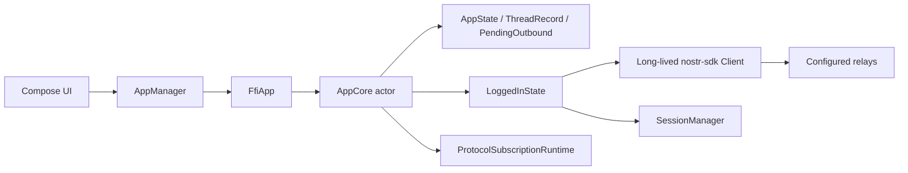
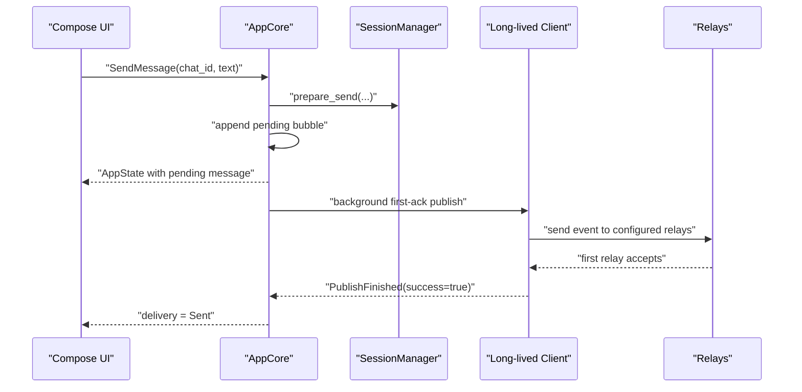
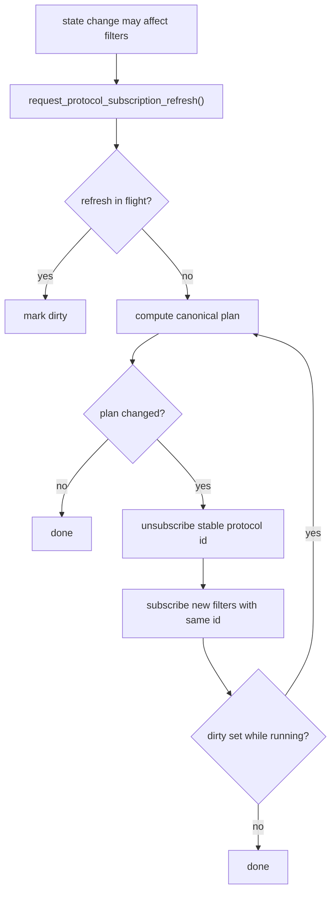

# Architecture

This file is the source of truth for the Android app architecture. Future changes should follow this split, and if implementation diverges this document must be updated in the same change.

## Repo Roles

- `/Users/l/Projects/iris-fork/nostr-double-ratchet`
  - Rust engine repo
  - `nostr-double-ratchet`: protocol/domain logic
  - `nostr-double-ratchet-nostr`: Nostr wire conversion
- `/Users/l/Projects/iris-fork/ndr-demo-android`
  - Android product repo
  - Compose UI and app-specific Rust runtime
  - `rust/`: app-facing UniFFI crate that owns the mobile app core

## Ownership Split

### Rust owns

- `FfiApp`, `AppCore`, and the UniFFI boundary used by Android
- account creation, import, and identity derivation
- app state transitions through `AppCore`
- `SessionManager`, `Session`, and `Invite`
- local chat thread and message state
- local outbox state and delivery state transitions
- persistence blob schema and versioning
- relay session configuration, protocol subscription planning, event interpretation, and protocol decisions
- publication of rosters, invites, invite responses, and messages

### Kotlin owns

- Compose rendering and navigation
- Android lifecycle and process startup
- Android Keystore persistence for the encrypted nsec
- platform integrations like clipboard, notifications, camera, and background behavior

## Runtime Topology



Important internal runtime structs:

```rust
struct LoggedInState {
    owner_pubkey: OwnerPubkey,
    owner_keys: Option<Keys>,
    device_keys: Keys,
    client: Client,
    relay_urls: Vec<RelayUrl>,
    session_manager: SessionManager,
    authorization_state: LocalAuthorizationState,
}

struct PendingOutbound {
    message_id: String,
    chat_id: String,
    body: String,
    prepared_publish: Option<PreparedPublishBatch>,
    publish_mode: OutboundPublishMode,
    reason: PendingSendReason,
    next_retry_at_secs: u64,
    in_flight: bool,
}

struct ProtocolSubscriptionRuntime {
    current_plan: Option<ProtocolSubscriptionPlan>,
    applying_plan: Option<ProtocolSubscriptionPlan>,
    refresh_in_flight: bool,
    refresh_dirty: bool,
    refresh_token: u64,
}
```

## Boundary

The Kotlin to Rust boundary is UniFFI.

Kotlin should not call `SessionManager` directly. Kotlin talks only to the Rust `FfiApp` facade exposed by `/Users/l/Projects/iris-fork/ndr-demo-android/rust`.

The protocol repo remains pure Rust. It contains no mobile bridge code and no UniFFI surface.

## Persistence Model

There is one persistence boundary:

- Kotlin stores the Rust secret key bytes encrypted with Android Keystore
- Rust stores the rest of the app snapshot and protocol state in app-local files
- Rust owns the format of that persisted state
- Rust persists prepared outbound publish batches so retry does not re-run `SessionManager::prepare_send(...)`

Kotlin must treat the Rust app core as authoritative for runtime and persisted protocol state.

## Runtime Flow

### Startup

1. Kotlin constructs `FfiApp`.
2. Kotlin restores the encrypted account bundle from Android Keystore storage.
3. Kotlin dispatches `RestoreAccountBundle` into Rust if an account exists.
4. Rust restores account, protocol state, local outbox state, and chat state.
5. Rust configures relays on the session client once and schedules a background `client.connect()`.
6. Rust requests one canonical protocol-subscription refresh.
7. Kotlin renders from `AppState` updates emitted by Rust.

### Ordinary Send

1. User enters text in Compose.
2. Kotlin dispatches `SendMessage`.
3. Rust calls `SessionManager::prepare_send(...)`.
4. Rust appends a local pending message immediately and persists the prepared publish batch.
5. Rust starts background ordinary publish against the already-configured session client.
6. Publish succeeds when the first relay accepts each event.
7. Rust marks the message `Sent` on publish completion and emits the updated `AppState`.



### First Contact Send

First-contact sends are intentionally different:

1. Rust persists a staged `PreparedPublishBatch`.
2. Rust publishes invite-response events first.
3. Rust waits `1500 ms`.
4. Rust publishes message events.
5. Retry reuses the stored prepared batch and does not re-run `prepare_send(...)`.

### Protocol Subscriptions

Subscriptions are not rebuilt opportunistically from raw filter vectors. `AppCore` computes a canonical sorted `ProtocolSubscriptionPlan` and coalesces refresh work.



### Receive

1. Rust receives raw relay data from its own relay client.
2. Rust interprets the event and mutates protocol/chat state.
3. Rust persists the updated state.
4. Kotlin renders the resulting `AppState`.

## Mobile Rule

All mobile business logic belongs in Rust unless it is Android platform behavior.

That means Kotlin should not own:

- key generation/import rules
- chat message history
- protocol interpretation
- session bootstrap logic
- Nostr event meaning
- relay connection management for the messaging runtime
- outbox retry semantics or subscription planning

Kotlin may own:

- UI-only ephemeral state such as current text field contents
- lifecycle orchestration
- encrypted secret storage
