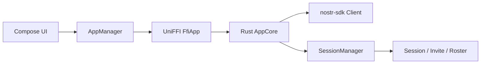
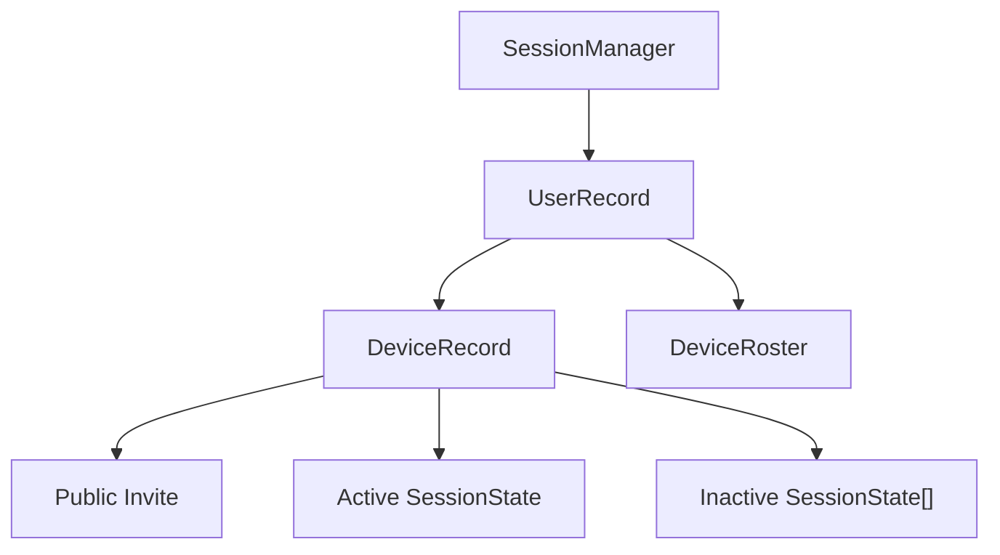
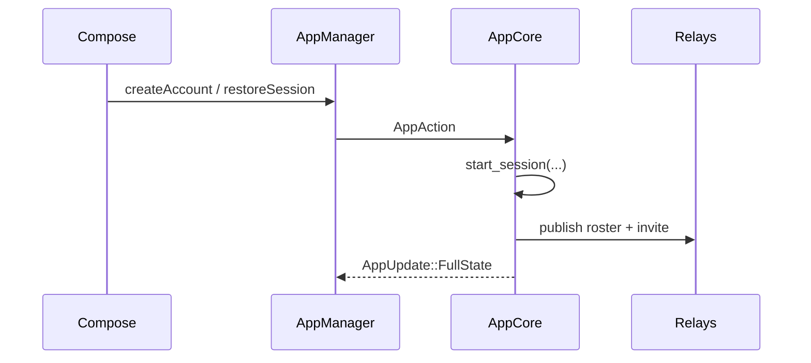
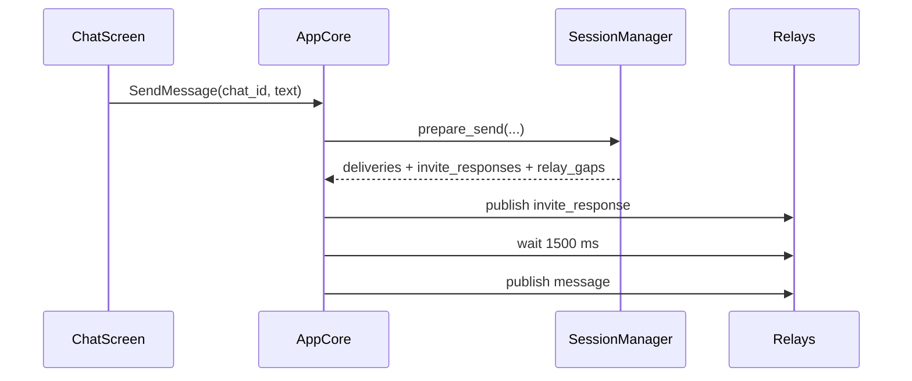
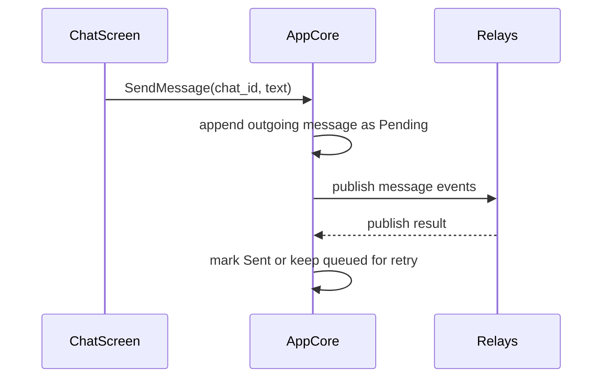

# Architecture Review

Review date: 2026-04-08

Scope:
- `/Users/l/Projects/iris-fork/ndr-demo-android`
- `/Users/l/Projects/iris-fork/nostr-double-ratchet`

This document records the architecture review that drove the P1/P2 fixes landed alongside it. It is architecture-first, with the remaining unresolved security note called out explicitly.

## System Topology



Ownership split:
- Kotlin owns rendering, Android lifecycle, secure secret storage, clipboard, and QR camera integration.
- Rust app core owns router state, chat state, persistence, relay subscriptions, and all protocol decisions.
- `nostr-double-ratchet` remains a pure Rust library with no mobile bridge code.

## App Surface

Key app-facing types:

```rust
pub struct FfiApp;

pub enum AppAction {
    CreateAccount,
    RestoreSession { nsec: String },
    Logout,
    CreateChat { peer_input: String },
    OpenChat { chat_id: String },
    SendMessage { chat_id: String, text: String },
    PushScreen { screen: Screen },
    UpdateScreenStack { stack: Vec<Screen> },
}

pub struct AppState {
    pub router: Router,
    pub account: Option<AccountSnapshot>,
    pub busy: BusyState,
    pub chat_list: Vec<ChatThreadSnapshot>,
    pub current_chat: Option<CurrentChatSnapshot>,
    pub toast: Option<String>,
}
```

Important Rust app-core entry points:

```rust
fn handle_action(&mut self, action: AppAction)
fn create_chat(&mut self, peer_input: &str)
fn open_chat(&mut self, chat_id: &str)
fn send_message(&mut self, chat_id: &str, text: &str)
fn handle_relay_event(&mut self, event: Event)
```

Assessment:
- The runtime is mostly aligned with the intended Pika-like split: native code is thin and Rust is the source of truth.
- The main intentional native exception is secure storage of the long-term secret and QR/camera behavior.

## Protocol/Core Model



Relevant library types:

```rust
pub struct SessionManager;
pub struct SessionManagerSnapshot;
pub struct PreparedSend;
pub enum RelayGap { MissingRoster { .. }, MissingDeviceInvite { .. } }
pub struct DeviceRoster;
pub struct Invite;
pub struct InviteResponseEnvelope;
pub struct SessionState;
pub struct MessageEnvelope;
pub struct ProtocolContext<'a, R> { pub now: UnixSeconds, pub rng: &'a mut R }
```

Product state vs protocol state:
- Product state lives in `ThreadRecord`, `AppState`, and the derived chat snapshots.
- Protocol state lives in `SessionManager`, `Invite`, `DeviceRoster`, and `SessionState`.
- The app currently uses the multi-device-capable library in a mostly single-device product shape.

## Runtime Flows

### Bootstrap / Restore



### First Contact



### Established Session



## Findings and Status

| Priority | Finding | Status |
| --- | --- | --- |
| P0 | Protocol/session snapshot is persisted in plaintext, including invite/session secret material. | Deferred on purpose in this change. |
| P1 | Established-session sends were marked `Sent` before any relay acceptance. | Fixed in `ndr-demo-android/rust/src/core.rs`. Outgoing messages now stay `Pending` until the publish path completes. |
| P1 | Invite-response owner claims were accepted without verification. | Fixed in `nostr-double-ratchet`. Unverified claims are parked under the device owner and migrated only after roster proof arrives. |
| P1 | Routine protocol refresh used `unsubscribe_all()`, creating unnecessary churn and blind windows. | Fixed in `ndr-demo-android/rust/src/core.rs`. The app now uses a stable named protocol subscription and only refreshes when filters actually change. |
| P2 | `pending_inbound` work was memory-only and could be lost on restart. | Fixed in `ndr-demo-android/rust/src/core.rs`. Pending inbound envelopes now persist and restore. |
| P2 | UI coverage around QR/chat creation lagged behind the app-core relay harness. | Tightened in `ndr-demo-android/app/src/androidTest`. Compose tests now cover the QR-scan entry path via a test-only override. |

## Validation Added

- `cargo test -p nostr-double-ratchet`
- `cargo test` in `ndr-demo-android/rust`

New or expanded test coverage now includes:
- unverified owner-claim parking and verified-claim migration
- stable protocol subscription identity
- established-session send remaining pending before publish completion
- pending inbound persistence across restore
- QR scan path populating the new-chat input in Compose tests

## Deferred Note

The plaintext persistence issue remains the highest-risk item:
- `ndr-demo-android/rust/src/core.rs` persists `SessionManagerSnapshot`
- that snapshot includes `Invite` and `SessionState`
- those types still contain secret material

That work should be addressed next by encrypting the Rust persistence blob or splitting secret protocol material into a secure storage boundary.
