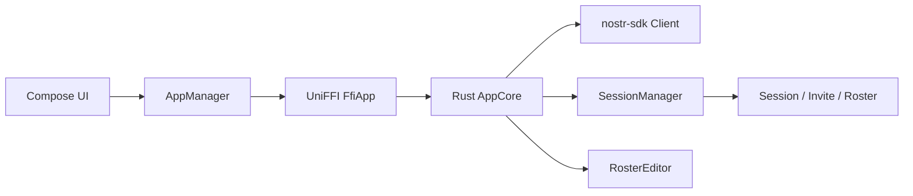
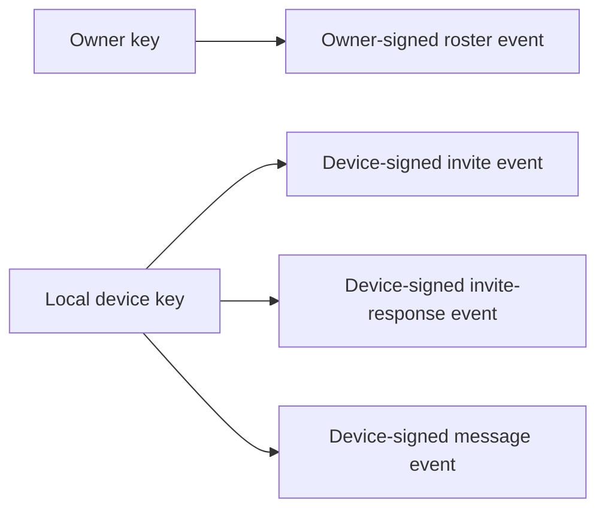
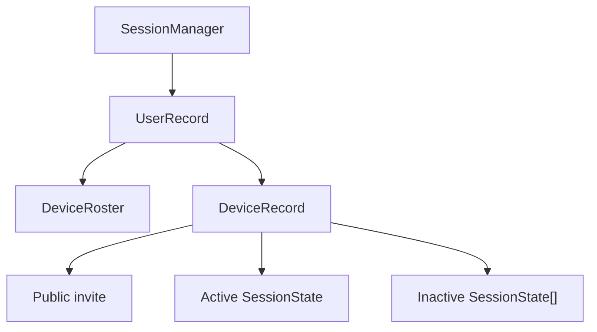
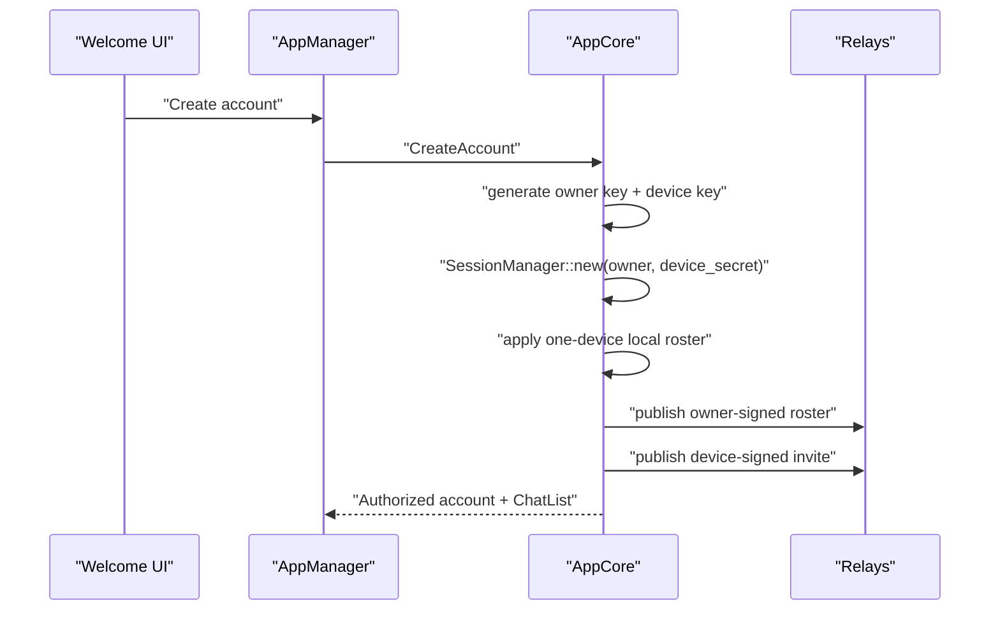
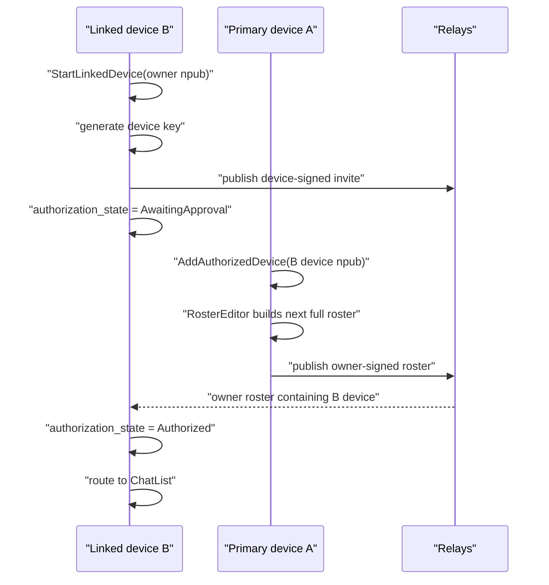
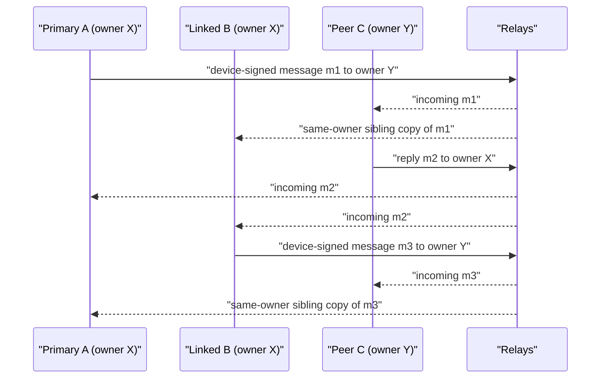
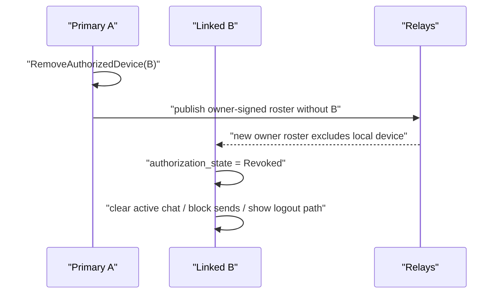
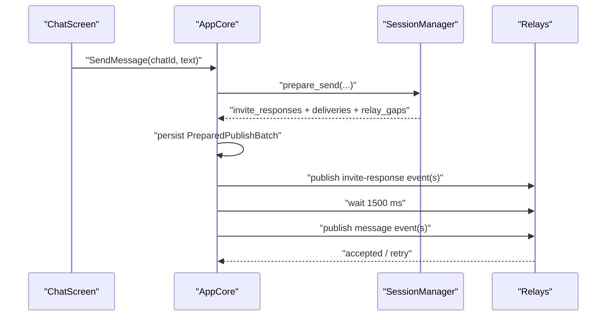
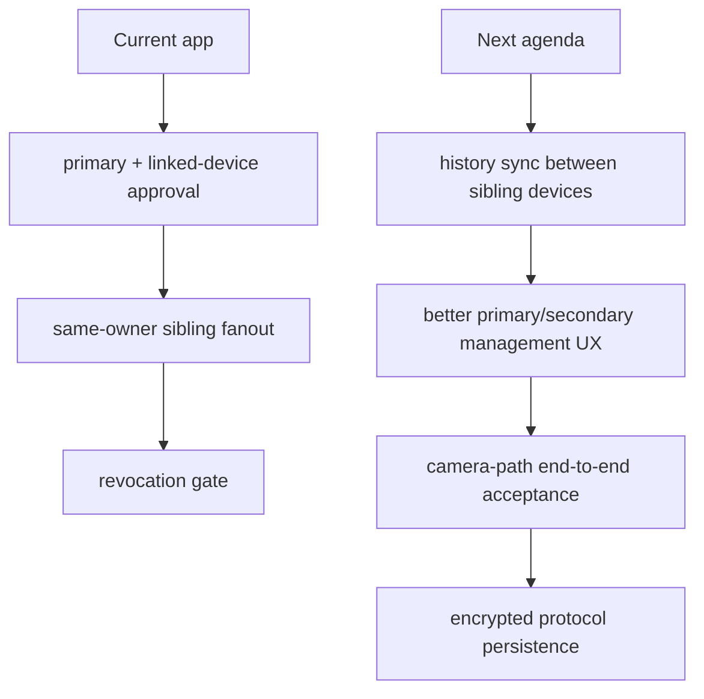

# Architecture Review

Review date: 2026-04-08

Scope:
- `/Users/l/Projects/iris-fork/ndr-demo-android`
- `/Users/l/Projects/iris-fork/nostr-double-ratchet`

Target revisions reviewed:
- `ndr-demo-android`: post-`e9ed7ea`, including linked-device validation and three-device fanout hardening from this pass
- `nostr-double-ratchet`: post-`9b6c9a1`

This is the current architecture and code review after the app moved to the explicit owner/device model and after the three-emulator public-relay validation passed.

## 1. System Topology





State and I/O ownership:
- Compose owns only ephemeral presentation state: draft text, dialog/sheet visibility, QR scanner visibility, and permission prompts.
- `AppManager` owns Android bootstrap orchestration and secure storage of the account bundle.
- `FfiApp` is the UniFFI bridge and update channel.
- `AppCore` owns router state, account state, device-authorization state, chat state, retry policy, persistence, relay subscriptions, and protocol orchestration.
- `SessionManager` owns owner/device records, invites, sessions, and protocol decisions.
- `RosterEditor` is the app-facing helper for full-snapshot roster CRUD.
- `nostr-sdk` performs network I/O; the app core decides what to publish and subscribe to.

Assessment:
- The architecture is now much closer to the intended split.
- Kotlin remains thin.
- The app is no longer pretending `owner == device` when using `SessionManager`.

## 2. App Surface

Important app-facing Rust surface:

```rust
#[uniffi::constructor]
pub fn new(data_dir: String, _keychain_group: String, _app_version: String) -> Arc<FfiApp>

pub fn state(&self) -> AppState
pub fn dispatch(&self, action: AppAction)
pub fn listen_for_updates(&self, reconciler: Box<dyn AppReconciler>)
```

```rust
pub enum AppAction {
    CreateAccount,
    RestoreSession { owner_nsec: String },
    RestoreAccountBundle {
        owner_nsec: Option<String>,
        owner_pubkey_hex: String,
        device_nsec: String,
    },
    StartLinkedDevice { owner_input: String },
    Logout,
    CreateChat { peer_input: String },
    OpenChat { chat_id: String },
    SendMessage { chat_id: String, text: String },
    AddAuthorizedDevice { device_input: String },
    RemoveAuthorizedDevice { device_pubkey_hex: String },
    AcknowledgeRevokedDevice,
    PushScreen { screen: Screen },
    UpdateScreenStack { stack: Vec<Screen> },
}
```

```rust
pub struct AppState {
    pub router: Router,
    pub account: Option<AccountSnapshot>,
    pub busy: BusyState,
    pub chat_list: Vec<ChatThreadSnapshot>,
    pub current_chat: Option<CurrentChatSnapshot>,
    pub device_roster: Option<DeviceRosterSnapshot>,
    pub toast: Option<String>,
}
```

Important Kotlin boundary methods:

```kotlin
fun createAccount()
fun restoreSession(nsecOrHex: String)
fun startLinkedDevice(ownerInput: String)
fun addAuthorizedDevice(deviceInput: String)
fun removeAuthorizedDevice(devicePubkeyHex: String)
fun createChat(peerInput: String)
fun openChat(chatId: String)
fun sendText(chatId: String, text: String)
fun logout()
```

Important app-core structs:

```rust
struct LoggedInState {
    owner_pubkey: OwnerPubkey,
    owner_keys: Option<Keys>,
    device_keys: Keys,
    authorization_state: LocalAuthorizationState,
    session_manager: SessionManager,
    client: Client,
}

struct PendingOutbound {
    message_id: String,
    chat_id: String,
    body: String,
    prepared_publish: Option<PreparedPublishBatch>,
    reason: PendingSendReason,
    next_retry_at_secs: u64,
    in_flight: bool,
}

struct PreparedPublishBatch {
    invite_events: Vec<Event>,
    message_events: Vec<Event>,
}
```

Assessment:
- The app-facing surface now models linked-device lifecycle explicitly.
- `AccountSnapshot` and `DeviceRosterSnapshot` are product-shaped, not protocol-shaped.
- Kotlin is dispatching actions and rendering Rust state, not reconstructing protocol behavior.

## 3. Protocol / Core Model



Relevant library types:

```rust
pub struct SessionManager;
pub struct SessionManagerSnapshot;
pub struct PreparedSend;
pub enum RelayGap { MissingRoster { .. }, MissingDeviceInvite { .. } }
pub struct DeviceRoster;
pub struct Invite;
pub struct InviteResponseEnvelope;
pub struct SessionState;
pub struct MessageEnvelope;
pub struct ProtocolContext<'a, R> { pub now: UnixSeconds, pub rng: &'a mut R }
```

Important library functions:

```rust
pub fn ensure_local_invite<R>(&mut self, ctx: &mut ProtocolContext<'_, R>) -> Result<&Invite>
pub fn apply_local_roster(&mut self, roster: DeviceRoster) -> RosterSnapshotDecision
pub fn observe_peer_roster(&mut self, owner_pubkey: OwnerPubkey, roster: DeviceRoster)
    -> RosterSnapshotDecision
pub fn observe_device_invite(&mut self, owner_pubkey: OwnerPubkey, invite: Invite) -> Result<()>
pub fn observe_invite_response<R>(&mut self, ctx: &mut ProtocolContext<'_, R>, envelope: &InviteResponseEnvelope)
    -> Result<Option<ProcessedInviteResponse>>
pub fn prepare_send<R>(&mut self, ctx: &mut ProtocolContext<'_, R>, recipient_owner: OwnerPubkey, payload: Vec<u8>)
    -> Result<PreparedSend>
pub fn receive<R>(&mut self, ctx: &mut ProtocolContext<'_, R>, sender_owner: OwnerPubkey, envelope: &MessageEnvelope)
    -> Result<Option<ReceivedMessage>>
```

Current product/protocol split:
- Product state:
  - router
  - account bundle state
  - authorization state
  - device-roster screen state
  - chat threads and current-chat snapshots
- Protocol state:
  - owner/device records
  - public invites
  - sessions
  - prepared protocol deliveries

Assessment:
- This boundary is now clean.
- `SessionManager` is used in the way the library intends: one owner, one explicit local device, and a real one-device roster even before linking a second device.

## 4. Runtime Flows

### Primary bootstrap



### Linked-device approval



### Three-device fanout



### Revocation



### Staged first-contact send



## 5. Code Review Findings

### P0: protocol persistence is still plaintext

Status:
- Still open.

Why it matters:
- `PersistedState` still stores `session_manager.snapshot()` directly.
- That snapshot still includes invite and session secret material.

Impact:
- Filesystem compromise exposes protocol secrets even though the account bundle itself is Keystore-protected on Android.

Recommended fix direction:
- encrypt the Rust snapshot at rest or split secret protocol material away from the plain JSON snapshot.

### P2: strongest relay harness still bypasses the full camera-to-chat UI path

Status:
- Still open as a testing-shape limitation.

Why it matters:
- The public-relay harness uses the real app runtime through `AppManager`, which is correct for protocol/runtime validation.
- It does not fully exercise one combined Compose + QR camera + relay end-to-end flow.

Impact:
- Runtime correctness is now well covered.
- The exact user camera path still depends on smoke tests plus manual QA.

Recommended fix direction:
- keep the current harness, but add one thin acceptance test that injects a scanner result through the actual welcome/new-chat UI flow before handing off to the runtime harness.

## 6. Validation

### Rust and Android validation

- `cargo test` in `ndr-demo-android/rust` passed
- `./gradlew :app:compileDebugKotlin :app:compileDebugAndroidTestKotlin` passed

### Public-relay three-emulator validation

Validated on 2026-04-08 with:
- `emulator-5554` = primary `A`
- `emulator-5556` = linked device `B`
- `emulator-5558` = external peer `C`

Passed matrix:
1. `A` created fresh owner `X`
2. `B` started linked-device flow from `A` owner `npub`
3. `A` added `B` device to the owner roster
4. `B` became authorized without restart
5. `C` created fresh owner `Y`
6. `A -> C` message `m1` delivered
   - `C` received `m1`
   - `B` saw the sibling copy of `m1`
7. `C -> X` reply `m2` delivered
   - `A` received `m2`
   - `B` received `m2`
8. `B -> C` message `m3` delivered
   - `C` received `m3`
   - `A` saw the sibling copy of `m3`
9. `A` removed `B` from the roster
   - `B` transitioned to `Revoked`
   - `B` send capability was blocked

This is the strongest validation the app has had so far:
- real public relays
- real installed APKs
- explicit linked-device approval
- same-owner sibling fanout
- revoke enforcement

## 7. What Changed In This Pass

Key outcomes:
- the app now uses a separate device identity for every `SessionManager` session
- the primary-only roster authority model is working on public relays
- linked-device onboarding works without restart
- same-owner sibling fanout works in both directions
- revocation works and blocks the revoked device immediately

Key implementation points:
- chat payloads now carry app-level routing metadata so sibling devices place messages in the correct peer thread
- authorization state is persisted so a fresh linked device does not get misclassified as revoked before approval
- recent-handshake tracking and invite subscriptions update fast enough for same-owner sibling sync
- the relay harness now has explicit linked-device, add/remove roster, authorization-wait, and revoke-wait entry points

## 8. Next Multi-Device Agenda



Recommended next steps:
1. history sync for newly linked devices
2. explicit device-management UX polish for stale/revoked/sibling status
3. one combined QR-camera-to-message acceptance test
4. encrypted protocol persistence at rest

## 9. References

Primary code anchors for the current design:
- `ndr-demo-android/rust/src/core.rs`
- `ndr-demo-android/rust/src/state.rs`
- `ndr-demo-android/rust/src/actions.rs`
- `ndr-demo-android/app/src/main/java/social/innode/ndr/demo/core/AppManager.kt`
- `ndr-demo-android/app/src/androidTest/java/social/innode/ndr/demo/RealRelayHarnessTest.kt`
- `nostr-double-ratchet/rust/crates/nostr-double-ratchet/src/session_manager.rs`
- `nostr-double-ratchet/rust/crates/nostr-double-ratchet/src/roster_editor.rs`
